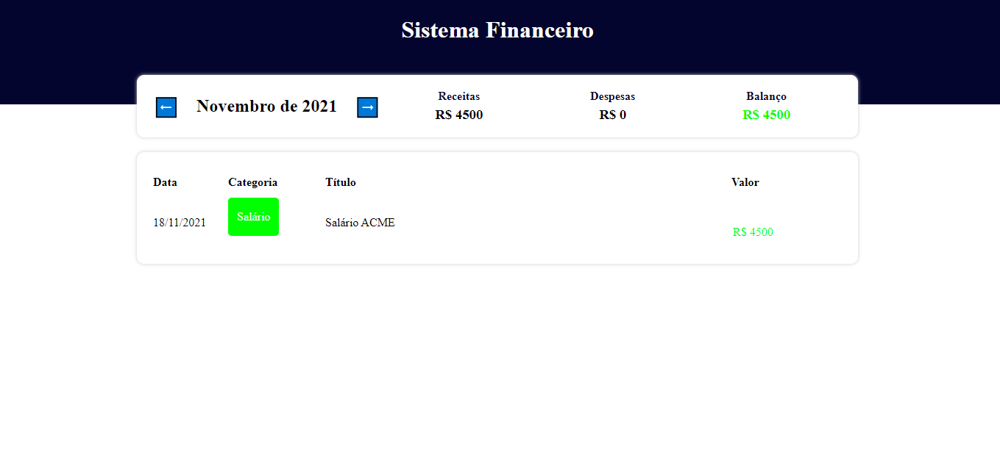

# Expense Tracker :books: :

O segundo projeto dessa maratona (5em5) de projetos é baseado em um sistema de finanças para qualquer usuario.
A imagem a baixo ilustra a arte do projeto:

A dinamica segui os seguites topicos: 

* Apresentar na tabela os gastos e lucros que o usuario teve naquele mês.
* Quando o usuario modificar o mês as informações da tabela serão atualizadas.
* Fazer um balanço para determinar se o mês em questão gerou prejuizo ou lucro.

